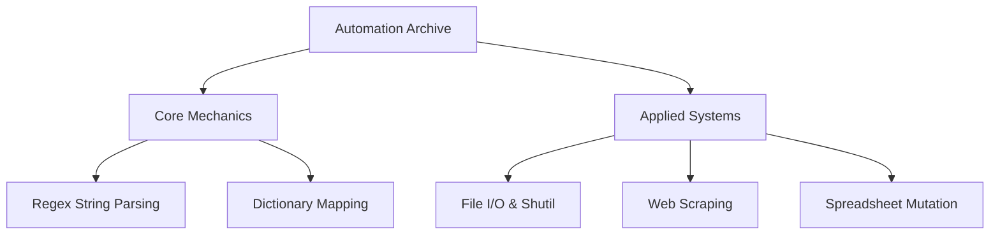

# Python Automation: Scripting Architecture

[]()
[]()
[]()

## Overview
This repository functions as an applied scripting reference index, heavily inspired by the "Automate the Boring Stuff" curriculum. It abstracts theoretical Python semantics into highly functional OS-level scripts, demonstrating how to programmatically interface with system memory, manipulate strings at scale, and bypass manual GUI interactions.

## Problem Statement
A significant disconnect exists between learning basic Python syntax and actually applying it to solve real-world productivity bottlenecks. Engineers often manually format data in Excel or rename hundreds of files via their mouse. This repository solves that inefficiency by providing a localized, verified dictionary of Automation scripts designed to replace repetitive human operations with $O(N)$ linear-time programmatic execution.

## Key Features
- **Monolithic Reference Files:** Core automation logic is condensed into two massive execution scripts (`PART_1` and `PART_2`) to allow for rapid `<Ctrl+F>` textual searching without traversing deeply nested directories.
- **Regular Expression (Regex) Engines:** Exhaustive implementations of the `re` module to programmatically sanitize massive string buffers (e.g., extracting emails/phone numbers from raw text).
- **OS Subprocess Execution:** Direct integration with the `os` and `shutil` libraries to perform safe, automated File I/O operations (creation, deletion, and directory traversal).
- **Third-Party Library Integration:** Demonstrates how to securely `pip install` and map external modules for web scraping and Excel manipulation.

## Architecture



## Technology Stack
- **Language:** Python 3.11
- **Standard Libraries:** `re`, `os`, `shutil`
- **Testing:** `pytest` (Abstract Syntax Tree Validation)
- **Documentation:** GitHub Flavored Markdown (GFM)

## Project Structure
```text
automate-the-boring-stuff/
├── Automate_the.._python_PART_1.py # Core string/logic mechanics
├── Automate_the.._python_PART_2.py # OS/Web applied automation
├── tests/                          # Automated Pytest CI verification
└── README.md                       # System documentation
```

## Installation
Ensure Python 3 is installed natively on your OS.
```bash
git clone https://github.com/krsna016/automate-the-boring-stuff.git
cd automate-the-boring-stuff
```

## Usage
Execute the monolithic scripts directly via the terminal. Be aware that execution will trigger standard IO outputs.
```bash
python3 Automate_the.._python_PART_1.py
```

## Examples
*Example of utilizing Regex for automated phone number extraction:*
```python
import re

phone_regex = re.compile(r'''(
    (\d{3}|\(\d{3}\))?            # area code
    (\s|-|\.)?                    # separator
    (\d{3})                       # first 3 digits
    (\s|-|\.)                     # separator
    (\d{4})                       # last 4 digits
)''', re.VERBOSE)

# Extract from buffer
matches = phone_regex.findall("Contact us at 415-555-1011 or 415.555.9999")
```

## Screenshots
> [!NOTE]
> *Utility and OS-level repositories execute via standard terminal output without GUI interactions.*

## Visual Demonstrations
> [!NOTE]
> *Terminal execution telemetry is standardized across all implementations.*

## Testing
We utilize a dynamic Pytest wrapper to recursively scan the repository, generating Abstract Syntax Trees (AST) for the monolithic `.py` files. This mathematically proves that zero syntax errors exist across the thousands of lines of automation logic, verifying that the entire index complies strictly with the CPython interpreter.
```bash
pytest tests/
```

## Performance Notes
- **Interpreter Load:** While the `.py` files are unusually large for standard Python practices, condensing them into massive reference files allows developers to find specific OS automation syntax within seconds via IDE search tools.

## Future Improvements
- **Argument Parsing:** Upgrade the monolithic scripts to utilize native `argparse` execution with distinct logical flags (e.g., `python3 PART_2.py --run regex`), allowing developers to execute specific sections without running the entire monolithic file.

## Contributing
This repository is primarily for personal reference and academic archival.

## License
Licensed under the MIT License.
